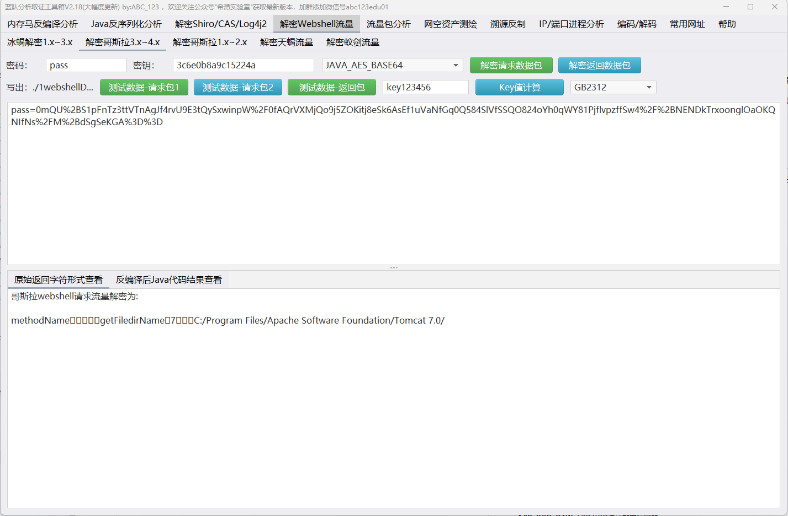

# Webshell解密器

一个功能强大的Webshell流量解密工具，专门用于解密和分析各种类型的Webshell通信数据。

## 项目简介

本项目是一个基于Spring Boot的Webshell流量解密器，目前主要支持哥斯拉(Godzilla) 3.x~4.x版本的流量解密。该工具能够解密多种加密算法和编码格式的Webshell通信数据，为安全分析人员提供便捷的流量分析能力。

其实就是 https://github.com/abc123info/BlueTeamTools 蓝队工具箱中的【解密Webshell流量】功能。可惜作者没有开源，只能自己实现了。


## 支持的解密器类型

目前已实现**14种**哥斯拉解密器，涵盖以下类型，每个类型都有对应的单元测试类与测试数据：

### Java类型
- **JAVA_AES_BASE64**: Java AES Base64解密器
- **JAVA_AES_RAW**: Java AES原始数据解密器

### PHP类型
- **PHP_XOR_BASE64**: PHP XOR Base64解密器
- **PHP_XOR_RAW**: PHP XOR原始数据解密器
- **PHP_EVAL_XOR_BASE64**: PHP Eval XOR Base64解密器

### C#类型
- **CSHAP_AES_BASE64**: C# AES Base64解密器
- **CSHAP_AES_RAW**: C# AES原始数据解密器
- **CSHAP_EVAL_AES_BASE64**: C# Eval AES Base64解密器
- **CSHAP_ASMX_AES_BASE64**: C# ASMX Web服务 AES Base64解密器

### ASP类型
- **ASP_BASE64**: ASP Base64解密器
- **ASP_RAW**: ASP原始数据解密器
- **ASP_XOR_BASE64**: ASP XOR Base64解密器
- **ASP_XOR_RAW**: ASP XOR原始数据解密器
- **ASP_EVAL_BASE64**: ASP Eval Base64解密器

## 技术架构

### 核心组件

- **抽象基类**
  - `AbstractBase64Decryptor`: Base64类型解密器的抽象基类
  - `AbstractRawDecryptor`: 原始数据类型解密器的抽象基类
  - `AbstractAspBase64Decryptor`: ASP类型Base64解密器的抽象基类

- **工具类**
  - `DecodeUtil`: 提供各种解码和解密功能
  - `StringExtractUtil`: 字符串内容提取工具
  - `ByteTypeUtil`: 字节类型检测工具

- **枚举类**
  - `DecryptorType`: 定义所有支持的解密器类型

### 设计模式

- **模板方法模式**: 抽象基类定义解密流程，具体实现类提供特定算法
- **工厂模式**: 通过`DecryptorType`枚举动态创建解密器实例
- **策略模式**: 不同的解密算法作为不同的策略实现

## 解密流程

### Base64类型解密流程
1. 数据提取：从请求/响应中提取加密数据
2. URL解码：处理URL编码的数据
3. Base64解码：将Base64编码转换为字节数组
4. 具体解密：使用特定算法进行解密
5. GZIP解压缩：如果数据被压缩则进行解压
6. 数据处理：反序列化或转换为字符串

### 原始数据类型解密流程
1. 十六进制解码：将十六进制字符串转换为字节数组
2. 具体解密：使用特定算法进行解密
3. GZIP解压缩：如果数据被压缩则进行解压
4. 数据处理：反序列化或转换为字符串

## 技术栈

- **框架**: Spring Boot
- **语言**: Java
- **工具库**: Hutool (提供加密解密、编码解码等工具方法)
- **构建工具**: Maven

## 项目结构

```
src/main/java/com/xsg/decryptor/
├── WebshellDecryptorApplication.java          # 主应用程序入口
├── godzilla/
│   ├── core/                                  # 核心解密器实现
│   │   ├── base/                             # 抽象基类
│   │   │   ├── AbstractBase64Decryptor.java
│   │   │   ├── AbstractRawDecryptor.java
│   │   │   └── AbstractAspBase64Decryptor.java
│   │   ├── JavaAesBase64Decryptor.java       # Java AES Base64解密器
│   │   ├── CShapAesBase64Decryptor.java      # C# AES Base64解密器
│   │   ├── CShapAsmxAesBase64Decryptor.java  # C# ASMX解密器
│   │   └── ...                               # 其他具体解密器实现
│   └── enums/
│       └── DecryptorType.java                # 解密器类型枚举
└── util/                                      # 工具类
    ├── DecodeUtil.java                       # 解码工具
    ├── StringExtractUtil.java               # 字符串提取工具
    └── ByteTypeUtil.java                    # 字节类型检测工具
```

## 未来规划

- **扩展支持**: 计划支持冰蝎(Behinder)等其他主流Webshell工具

---

**注意**: 本工具仅用于合法的安全研究和渗透测试，请勿用于非法用途。使用者需要对使用本工具的行为承担相应的法律责任。